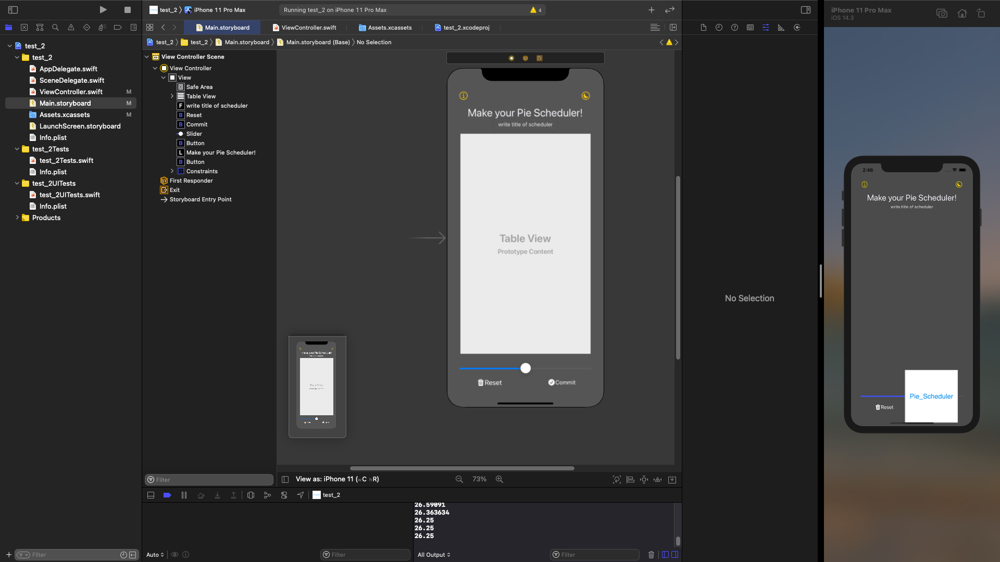
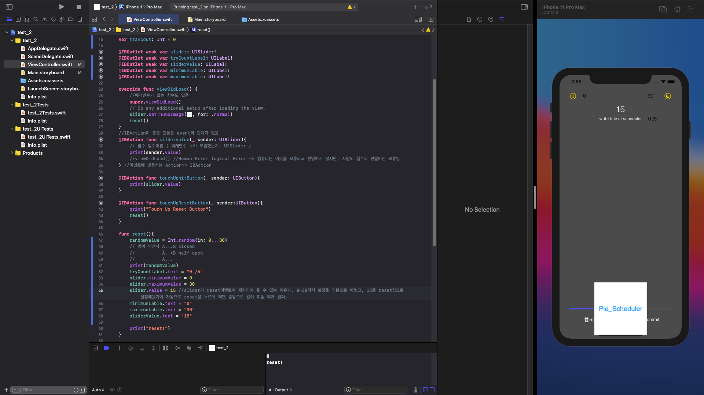
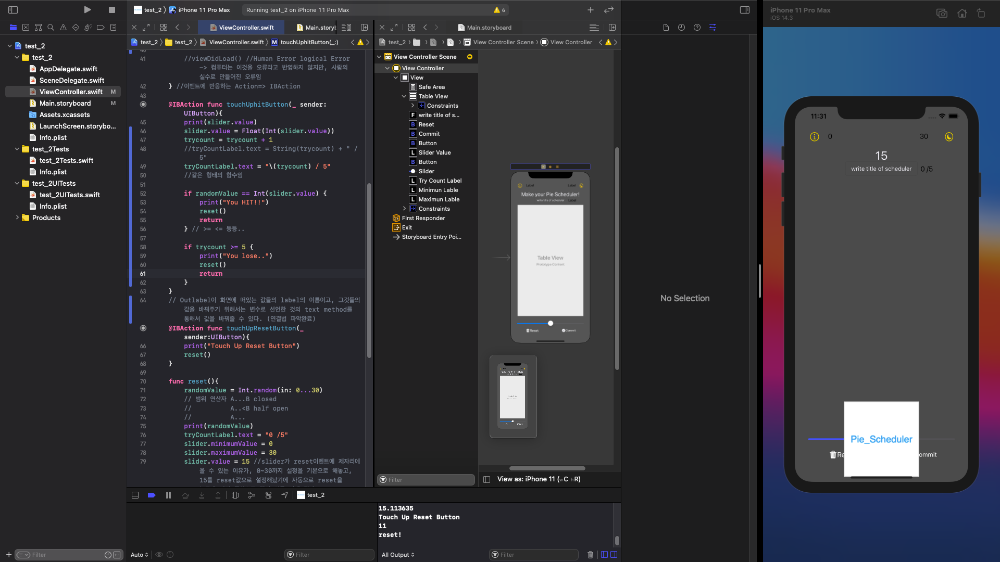

# Swift_Pie_Scheduler

## Development Environment
* Mac mini(Big sur)

## History
### 2020/12/28
* 기본 UI 제작
* 기본 이벤트 제작

### 2020/12/29
* Reset button 클릭시 slide 중앙 정렬
* 초기 이벤트 연결 방법 
* 범위 함수 

* output label 과 code의 연동성 파악
* event들의 method 연동성 파악
* 비교 연산자 및 함수 끝내기 관련 방법

